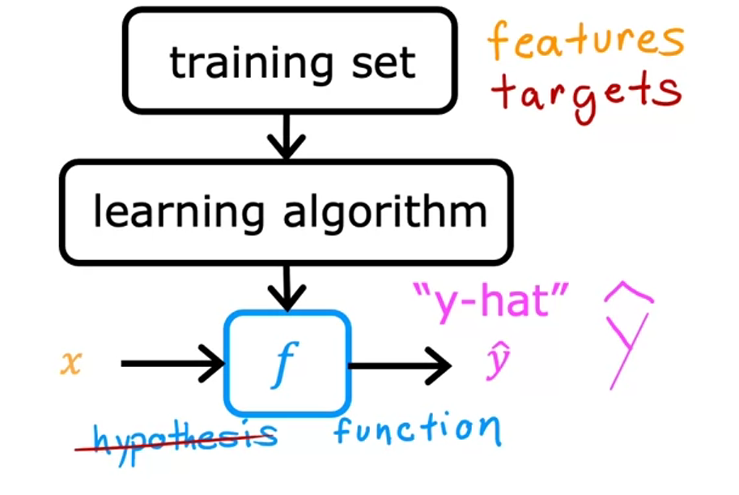
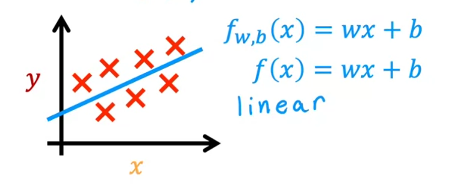

# Linear Regression Model Part 2

Let's look in this part at the process of how supervised learning works. `Supervised learning algorithm` will input a dataset and then what exactly does it do and what does it output? You will find out. Recall that a `training set` in _supervised learning_ includes both the `input features`, such as **the size of the house** and also the `output targets`, such as **the price of the house**. The output targets are the right answers to the model we'll learn from. 

To train the model, you feed the training set, both the _input features_ and the _output targets_ to your learning algorithm. Then your supervised learning algorithm will produce some function.

We'll write this function as lowercase f, where f stands for function. Historically, this function used to be called a `hypothesis`, but I'm just going to call it a `function f` in this class. The job with `f` is <u> to take a new input x and output and estimate or a prediction, which I'm going to call y-hat </u>, and it's written like the _variable y with this little hat symbol on top_ . 

In machine learning, the convention is that _y-hat_ is the estimate or the prediction for y. The `function f is called the model, X is called the input or the input feature, and the output of the model is the prediction, y-hat`. The model's prediction is the estimated value of y. <u> When the symbol is just the letter y, then that refers to the target, which is the actual true value in the training set </u> . In contrast, <u> y-hat is an estimate </u>. It may or may not be the actual true value. 

Well, if you're helping your client to sell the house, well, the true price of the house is unknown until they sell it. Your model f, given the size, outputs the price which is the estimator, that is the prediction of what the true price will be. 

Now, when we design a learning algorithm, a key question is, <u> how are we going to represent the function f? Or in other words, what is the math formula we're going to use to compute f?</u> For now, let's stick with **f** being a _straight_ line. You're function can be written as `f_w,b of x equals, I'm going to use w times x plus b`. 

_w and b will be defined soon_. But for now, just know that <u> w and b are numbers, and the values chosen for w and b will determine the prediction y-hat based on the input feature x </u>. This `f_w b of x` _means_ `f is a function that takes x as input, and depending on the values of w and b, f will output some value of a prediction y-hat `. As an alternative to writing this, `f_w, b of x`, You can sometimes just write `f of x` **without explicitly including w and b into subscript**. Is just a simpler notation that means exactly the same thing as f_w b of x. Let's plot the training set on the graph where the input feature x is on the horizontal axis and the output target y is on the vertical axis. 

Remember, the algorithm learns from this data and generates the best-fit line like maybe this one here. `This straight line is the linear function f_w b of x equals w times x plus b. Or more simply, we can drop w and b and just write f of x equals wx plus b`. Here's _what this function is doing_, **it's making predictions for the value of y using a streamline function of x**. You may ask, why are we choosing a linear function, where linear function is just a fancy term for a straight line instead of some non-linear function like a curve or a parabola? Well, sometimes you want to fit more complex non-linear functions as well, like a curve like this. 

But since this linear function is relatively simple and easy to work with, let's use a line as a foundation that will eventually help you to get to more complex models that are non-linear. This particular model has a name, it's called `linear regression`. More specifically, this is `linear regression with one variable`, **where the phrase one variable means that there's a single input variable or feature x, namely the size of the house**. <u> Another name for a linear model with one input variable is `univariate linear regression` </u>, where uni means _one_ in Latin, and where variate means _variable_. Univariate is just a fancy way of saying one variable. In a later sections, you'll also see a variation of regression where you'll want to make a prediction based not just on the size of a house, but on a bunch of other things that you may know about the house such as number of bedrooms and other features. By the way, when you're done with this section, there is another [jupyter notebook](). You don't need to write any code. Just review it, run the code and see what it does after cloning it and opening it in your own IDE. **That will show you how to define in Python a straight line function**. _The notebook will let you choose the values of w and b to try to fit the training data. You don't have to work with notebook if you don't want to, but I hope you play with it when you're done with learning this part_ . That's `linear regression`. In order for you to make this work, one of the most important things you have to do is construct a [cost function](CostFunctionFormula.md). The idea of a `cost function` is one of the most universal and important ideas in machine learning, and is used in both linear regression and in training many of the most advanced AI models in the world. In the next part take a look at how you can construct a cost function.

