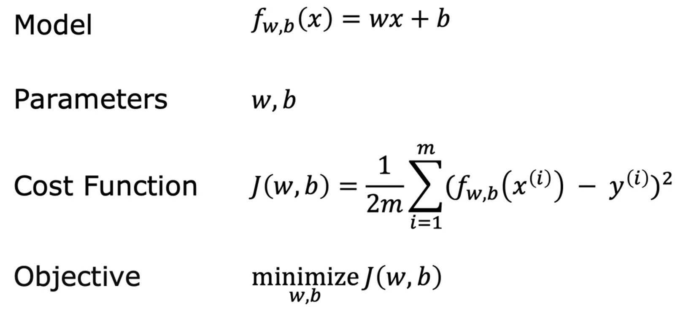
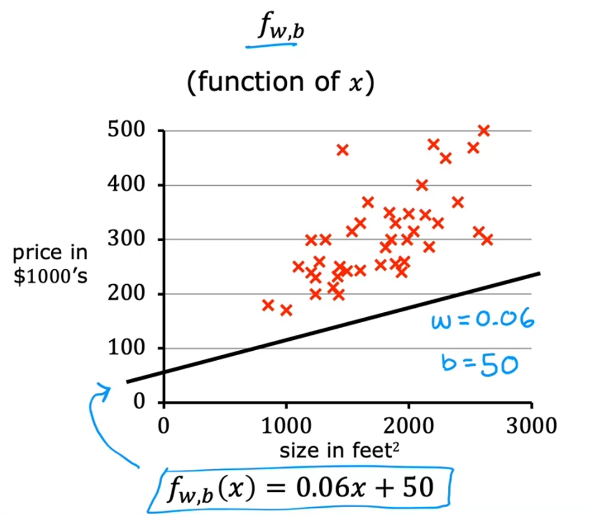
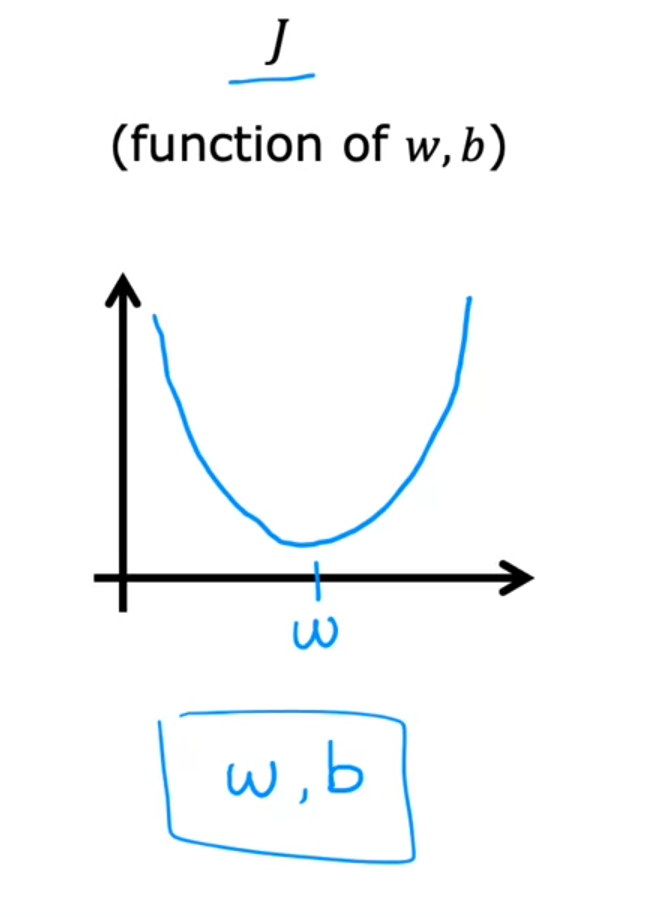
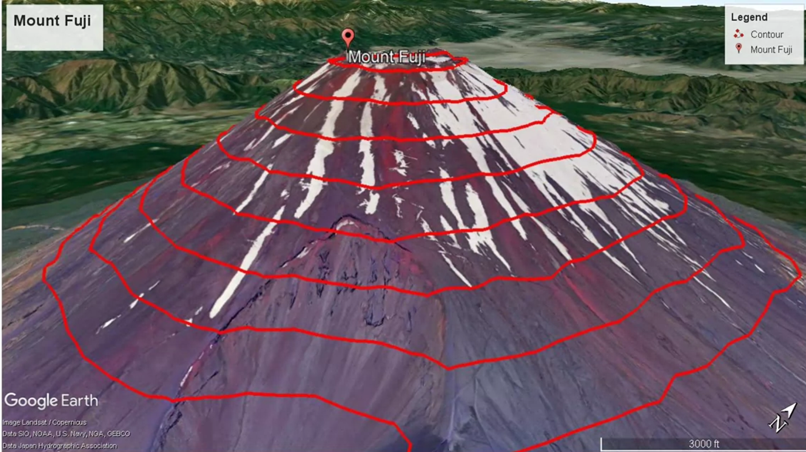
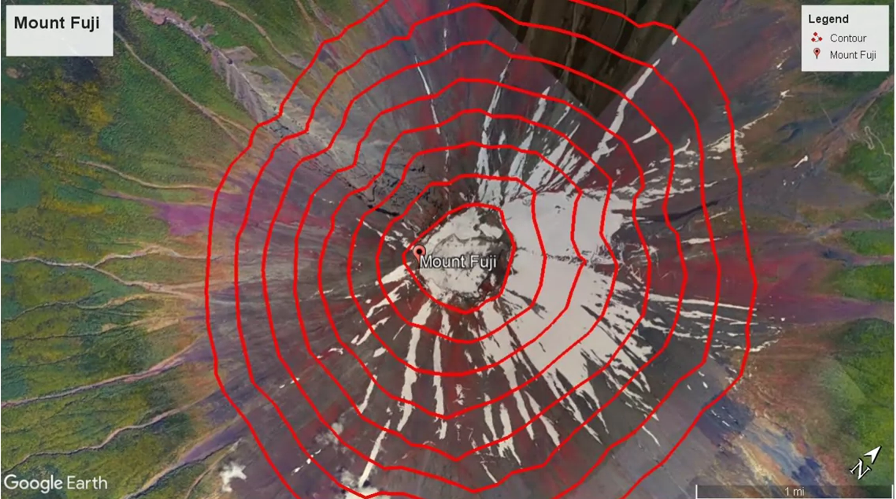
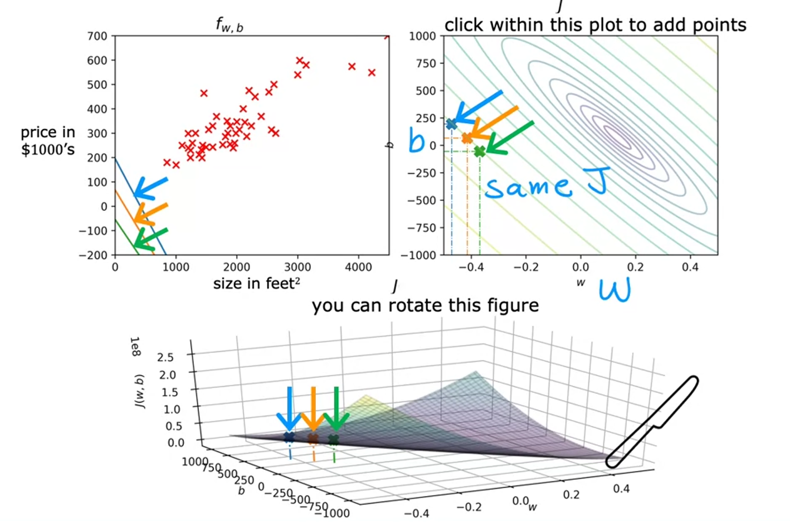
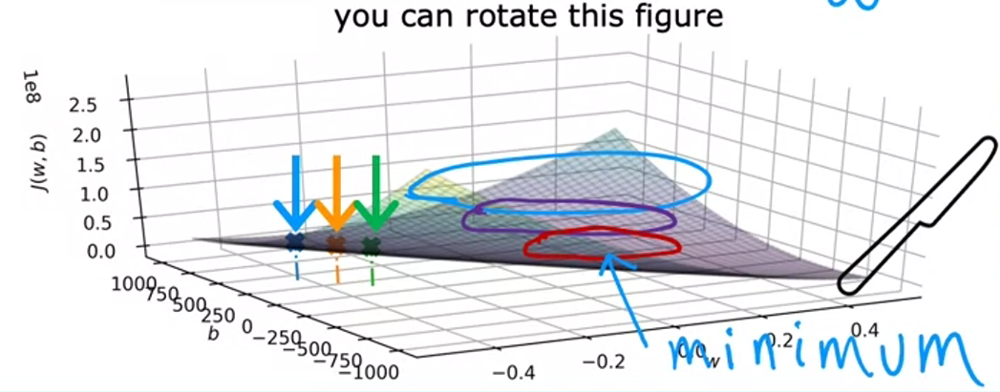

# Visualizing the Cost Function 
In the last part, you saw one visualization of the cost function J of w or J of w, b. Let's look at some further richer visualizations so that you can get an even better intuition about what the cost function is doing. 

Here is what we've seen so far. There's the model, the model's parameters `w` and `b`, the `cost function J of w and b`, as well as the `goal of linear regression, which is to minimize the cost function J of w and b over parameters w and b`. In the last part , we had temporarily set b to zero in order to simplify the visualizations.

Now, let's go back to the original model with both parameters w and b `without setting b to be equal to 0`. Same as last time, we want to get a visual understanding of the model function, f of x, shown here on the left, and how it relates to the cost function J of w, b, shown here on the right. 

Here's a training set of house sizes and prices. Let's say you pick one possible function of x, like this one. 

Here, I've set `w to 0.06` and `b to 50`. `f of x is 0.06 times x plus 50`. 
> Note that this is not a particularly good model for this training set, is actually a pretty bad model. It seems to consistently underestimate housing prices. 

Given these values for w and b let's look at what the cost function J of w and b may look like. Recall what we saw last time was when you had only w, because we temporarily set b to zero to simplify things, but then we had come up with a plot of the cost function that look like this as a function of w only. When we had only one parameter, w, the cost function had this U-shaped curve, shaped a bit like a soup bowl.

Now, in this housing price example that we have on this slide, we have two parameters, w and b. The plots becomes a little more complex. It turns out that the cost function also has a similar shape like a soup bowl, except in three dimensions instead of two. 

In fact, depending on your training set, the cost function will look something like this.

To me, this looks like a soup bowl, or maybe to you it looks like a curved dinner plate or a hammock. Actually that sounds relaxing too, and there's your coconut drink. 

Maybe when you're done with this course, you should treat yourself to vacation and relax in a hammock like this. 

What you see here is a `3D-surface plot` where the `axes are labeled w and b`. As you `vary w and b`, which are the two parameters of the model, you get different values for the cost function `J of w, and b`. This is a lot like the `U-shaped` curve you saw in the last part, except `instead of having one parameter w as input for the j`, `you now have two parameters, w and b as inputs` into this soup bowl or this hammock-shaped function J. I just want to point out that any single point on this surface represents some particular choice of w and b. 

For example, if w was minus 10 and b was minus 15, then the height of the surface above this point is the value of j when w is minus 10 and b is minus 15. 

<video autoplay loop muted playsinline>
  <source src="./../../Assets/Clips/VCF.mp4" type="video/mp4">
  Your browser does not support the video tag.
</video>

Now, in order to look even more closely at specific points, there's another way of plotting the cost function J that would be useful for visualization, which is, rather than using these 3D-surface plots, I like to take this exact same function J. I'm not changing the function J at all and plot it using something called `a contour plot`.
If you've ever seen a topographical map showing how high different mountains are, the contours in a topographical map are basically horizontal slices of the landscape of say, a mountain. This image is of Mount Fuji in Japan. 

If you fly directly above the mountain, that's what this contour map looks like. 

It shows all the points, they're at the same height for different heights. At the bottom of this slide is a `3D-surface plot of the cost function J`. I know it doesn't look very bowl-shaped, but it is actually a bowl just very stretched out, which is why it looks like that. In a notebook, that is shortly to follow, you will be able to see this in 3D and spin around the surface yourself and it'll look more obviously bowl-shaped there.

Next, here on the upper right is a contour plot of this exact same cost function as that shown at the bottom. `The two axes on this contour plots are b, on the vertical axis, and w on the horizontal axis`. `What each of these ovals, also called ellipses, shows, is the center points on the 3D surface which are at the exact same height`. In other words, the set of points which have the same value for the cost function J. To get the contour plots, you take the 3D surface at the bottom and you use a knife to slice it horizontally. You take horizontal slices of that 3D surface and get all the points, they're at the same height.

Therefore, each horizontal slice ends up being shown as one of these ellipses or one of these ovals. Concretely, if you take that point, and that point, and that point, all of these three points have the same value for the cost function J, even though they have different values for w and b. In the figure on the upper left, you see also that these three points correspond to different functions, f, all three of which are actually `pretty bad for predicting housing prices` in this case. 

Now, the bottom of the bowl, where the cost function J is at a minimum, is this point right here, at the center of this concentric ovals. If you haven't seen contour plots much before, I'd like you to imagine, if you will, that you are flying high up above the bowl in an airplane or in a rocket ship, and you're looking straight down at it. That is as if you set your computer monitor flat on your desk facing up and the bowl shape is coming directly out of your screen, rising above you desk. Imagine that the bowl shape grows out of your computer screen lying flat like that, so that each of these ovals have the same height above your screen and the minimum of the bowl is right down there in the center of the smallest oval. It turns out that the `contour plots are a convenient way to visualize the 3D cost function J`, `but in a way, there's plotted in just 2D`. In this part, you saw how the 3D bowl-shaped surface plot can also be visualized as a contour plot. Using this visualization too, in the next part, you'll visualize some specific choices of w and b in the `linear regression model` so that you can see how these different choices affect the straight line you're fitting to the data.

