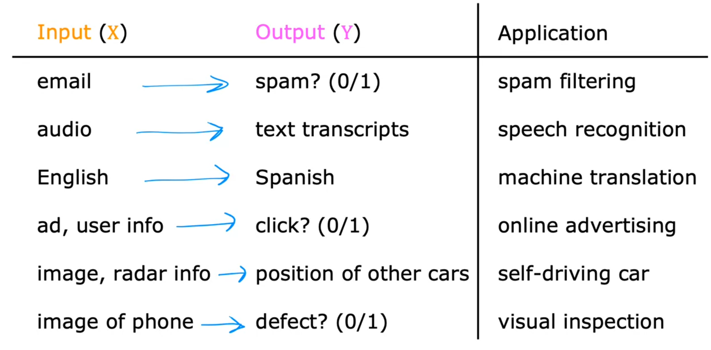
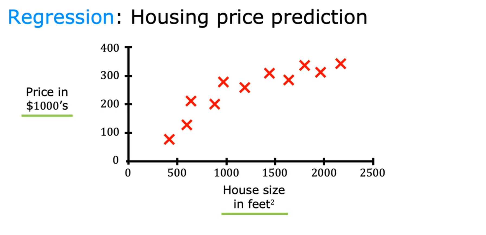
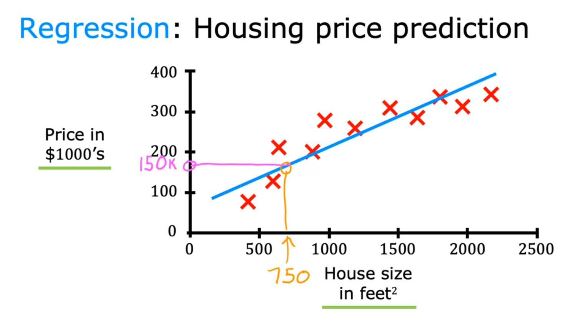
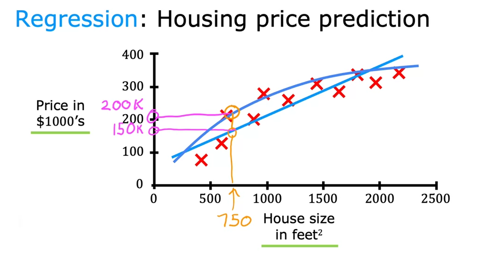

# Supervised Learning Part 1
Machine learning is creating tremendous economic value today. I think 99 percent of the economic value created by machine learning today is through one type of machine learning, which is called `supervised learning`.

Let's take a look at what that means. <u>Supervised machine learning </u> or more commonly, <u> supervised learning </u>, refers to `algorithms that learn x to y or input to output mappings. The key characteristic of supervised learning is that you give your learning algorithm examples to learn from.` That includes the right answers, whereby right answer, I mean, the correct label y for a given input x, and is by seeing correct pairs of input x and desired output label y that the learning algorithm eventually learns to take just the input alone without the output label and gives a reasonably accurate prediction or guess of the output.

Let's look at some examples. If the input x is an email and the output y is this email, spam or not spam, this gives you your spam filter. `Or` if the input is an audio clip and the algorithm's job is output the text transcript, then this is speech recognition. `Or` if you want to input English and have it output to corresponding Spanish, Arabic, Hindi, Chinese, Japanese, or something else translation, then that's machine translation. `Or` the most lucrative form of supervised learning today is probably used in online advertising.

Nearly all the large online ad platforms have a learning algorithm that inputs some information about an ad and some information about you and then tries to figure out if you will click on that ad or not. Because by showing you ads they're just slightly more likely to click on, for these large online ad platforms, every click is revenue, this actually drives a lot of revenue for these companies. This maybe not the most inspiring application, but it certainly has a significant economic impact in some countries today. `Or` if you want to build a self-driving car, the learning algorithm would take as input an image and some information from other sensors such as a radar or other things and then try to output the position of, say, other cars so that your self-driving car can safely drive around the other cars. `Or` take manufacturing. You can have a learning algorithm takes as input a picture of a manufactured product, say a cell phone that just rolled off the production line and have the learning algorithm output whether or not there is a scratch, dent, or other defect in the product. This is called visual inspection and it's helping manufacturers reduce or prevent defects in their products.

In all of these applications, you will first train your model with examples of inputs x and the right answers, that is the labels y. After the model has learned from these input, output, or x and y pairs, they can then take a brand new input x, something it has never seen before, and try to produce the appropriate corresponding output y.

Let's dive more deeply into one specific example. Say you want to predict housing prices based on the size of the house. You've collected some data and say you plot the data and it looks like this. Here on the horizontal axis is the size of the house in square feet. Yes, I live in the United States where we still use square feet. I know most of the world uses square meters. Here on the vertical axis is the price of the house in, say, thousands of dollars.

With this data, let's say a friend wants to know what's the price for their 750 square foot house. How can the learning algorithm help you? One thing a learning algorithm might be able to do is say, for the straight line to the data and reading off the straight line, it looks like your friend's house could be sold for maybe about, I don't know, $150,000. 

But fitting a straight line isn't the only learning algorithm you can use. There are others that could work better for this application. For example, routed and fitting a straight line, you might decide that it's better to fit a curve, a function that's slightly more complicated or more complex than a straight line.

If you do that and make a prediction here, then it looks like, well, your friend's house could be sold for closer to $200,000. Now, it doesn't seem appropriate to pick the one that gives your friend the best price, but one thing you see is how to get an algorithm to systematically choose the most appropriate line or curve or other thing to fit to this data. What you've seen in this slide is an example of `supervised learning`. Because we gave the algorithm a dataset in which the so-called right answer, that is the label or the correct price y is given for every house on the plot. The task of the learning algorithm is to produce more of these right answers, specifically predicting what is the likely price for other houses like your friend's house. That's why this is supervised learning. To define a little bit more terminology, this housing price prediction is the particular type of supervised learning called `regression`. By `Rregression`, I mean we're `trying to predict a number from infinitely many possible numbers` such as the house prices in our example, which could be 150,000 or 70,000 or 183,000 or any other number in between. That's supervised learning, learning input, output, or x to y mappings.