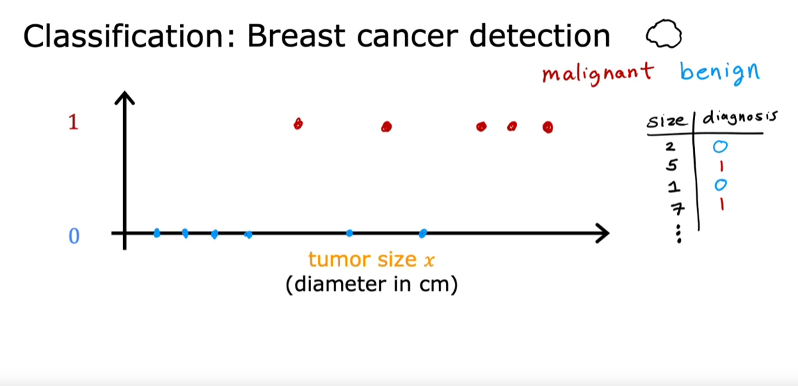
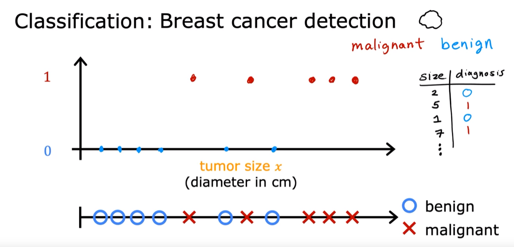
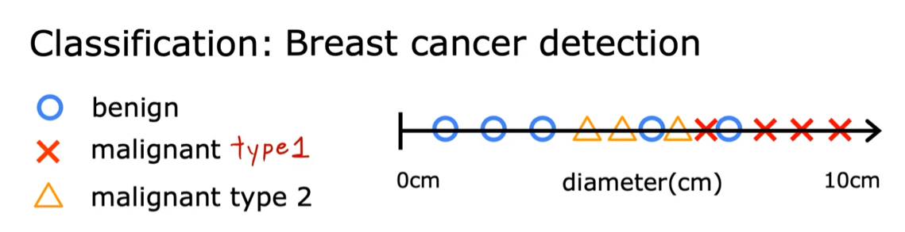
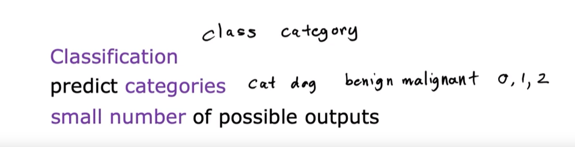
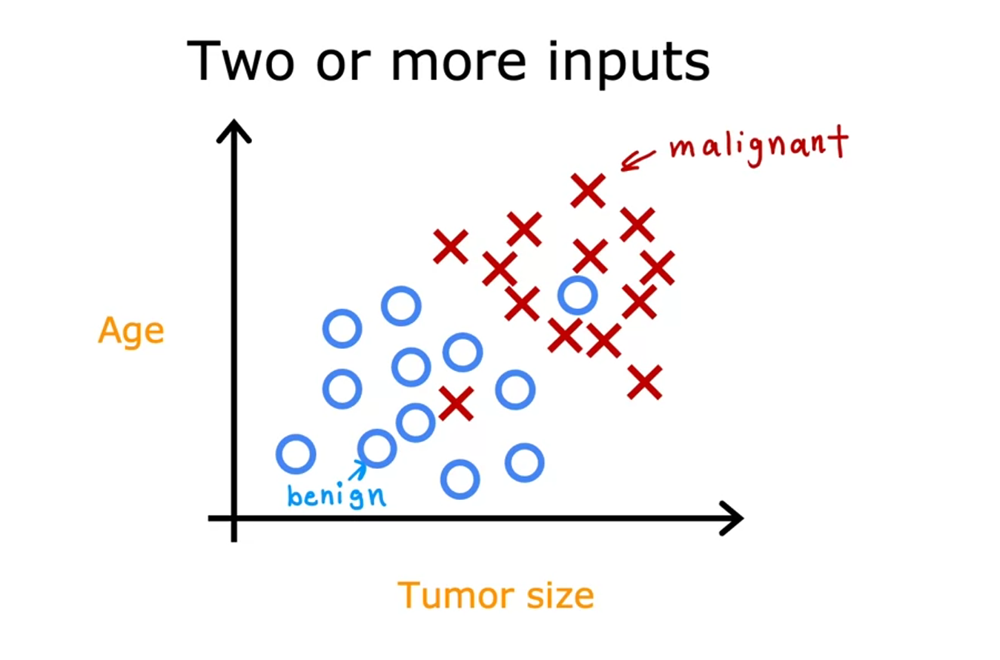
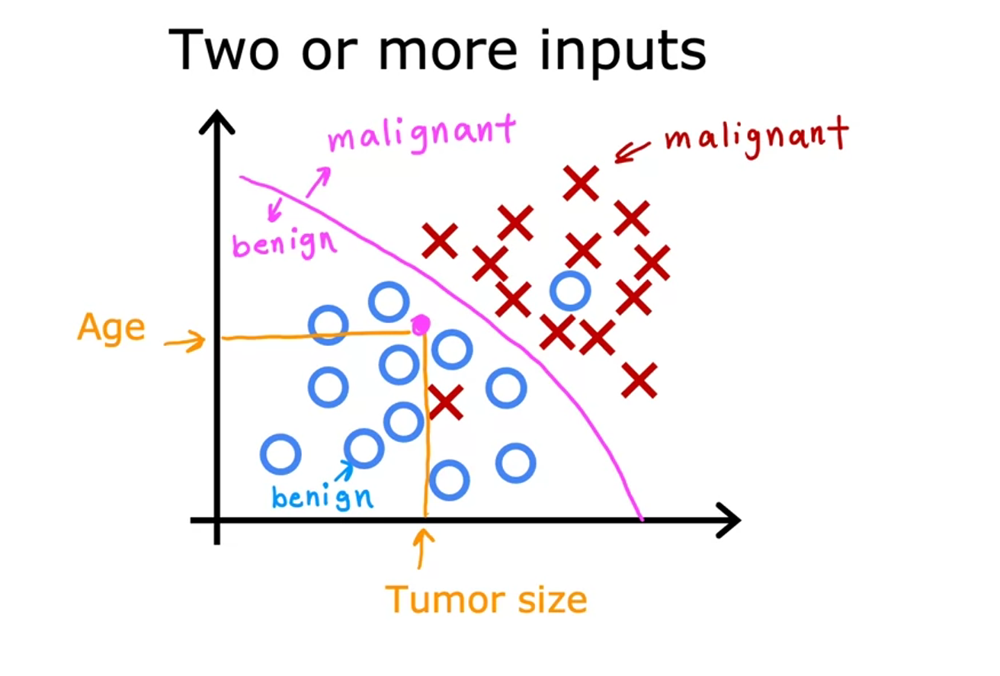
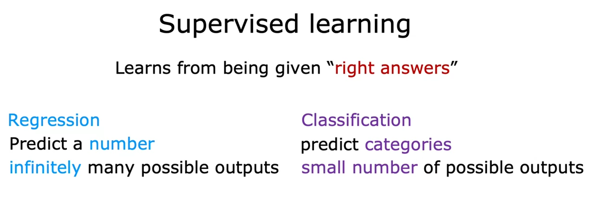

# Supervised Learning Part 2
So supervised learning algorithms learn to predict input, output or X to Y mapping. And in the previous part you learned that `regression algorithms`, <u> which is a type of supervised learning algorithm learns to predict numbers out of infinitely many possible numbers</u>. There's a second major type of supervised learning algorithm called a `classification algorithm`. Let's take a look at what this means.

Take breast cancer detection as an example of a classification problem. Say you're building a machine learning system so that doctors can have a diagnostic tool to detect breast cancer. This is important because early detection could potentially save a patient's life. Using a patient's medical records your machine learning system tries to figure out if a tumor that is a lump is `malignant` <u> meaning cancerous or dangerous</u>. Or if that tumor, that lump is `benign`, <u> meaning that it's just a lump that isn't cancerous and isn't that dangerous?</u> 

So maybe your dataset has tumors of various sizes. And these tumors are labeled as either benign, which I will designate in this example with a 0 or malignant, which will designate in this example with a 1. You can then plot your data on a graph like this where the horizontal axis represents the size of the tumor and the vertical axis takes on only two values 0 or 1 depending on whether the tumor is benign, 0 or malignant 1. 

`One reason that this is different from regression is that we're trying to predict only a small number of possible outputs or categories`. In this case two possible outputs 0 or 1, benign or malignant. This is different from regression which tries to predict any number, all of the infinitely many number of possible numbers. And so the fact that there are only two possible outputs is what makes this classification. Because there are only two possible outputs or two possible categories in this example, you can also plot this data set on a line like this.

Right now, I'm going to use two different symbols to denote the category using a circle an O to denote the benign examples and a cross to denote the malignant examples. And if new patients walks in for a diagnosis and they have a lump that is this size, then the question is, <u> will your system classify this tumor as benign or malignant? It turns out that in classification problems you can also have more than two possible output categories.</u> Maybe you're learning algorithm can output multiple types of cancer diagnosis if it turns out to be malignant.

So let's call two different types of cancer type 1 and type 2. In this case the average would have three possible output categories it could predict. And by the way in classification, the terms output classes and output categories are often used interchangeably. So what I say class or category when referring to the output, it means the same thing. So to summarize classification algorithms predict categories. Categories don't have to be numbers. It could be non numeric for example, it can predict whether a picture is that of a cat or a dog. And it can predict if a tumor is benign or malignant. Categories can also be numbers like 0, 1 or 0, 1, 2.

But what makes classification different from regression when you're interpreting the numbers is that classification predicts a small finite limited set of possible output categories such as 0, 1 and 2 but not all possible numbers in between like 0.5 or 1.7. In the example of supervised learning that we've been looking at, we had only one input value the size of the tumor. But you can also use more than one input value to predict an output. 

Here's an example, instead of just knowing the tumor size, say you also have each patient's age in years. Your new data set now has two inputs, age and tumor size. What in this new dataset we're going to use circles to show patients whose tumors are benign and crosses to show the patients with a tumor that was malignant. 

So when a new patient comes in, the doctor can measure the patient's tumor size and also record the patient's age. And so given this, how can we predict if this patient's tumor is benign or malignant? Well, given the day said like this, what the learning algorithm might do is find some boundary that separates out the malignant tumors from the benign ones. 

So the learning algorithm has to decide how to fit a boundary line through this data. The boundary line found by the learning algorithm would help the doctor with the diagnosis. In this case the tumor is more likely to be benign. From this example we have seen how to inputs the patient's age and tumor size can be used. In other machine learning problems often many more input values are required. In the context of breast cancer detection, additional input features such as the thickness of the tumor clump, uniformity of the cell size, and uniformity of the cell shape may be used to enhance the accuracy of the predictions. These features are incorporated into the learning process to create a more comprehensive and reliable model for detecting breast cancer. The two major types of supervised learning our `regression` and `classification`. In a `regression` application like <u> predicting prices of houses, the learning algorithm has to predict numbers from infinitely many possible output numbers</u>. Whereas in `classification` the <u> learning algorithm has to make a prediction of a category, all of a small set of possible outputs</u>. 

**Question:**
Supervised learning is when we give our learning algorithm the right answer y  for each example to learn from.  Which is an example of supervised learning?
- Calculating the average age of a group of customers.
- Spam filtering.
> Spam filtering (emails labeled as "spam" or "not spam" are examples used for training a supervised learning algorithm of `classification`)

So you now know what is supervised learning, including both regression and classification.