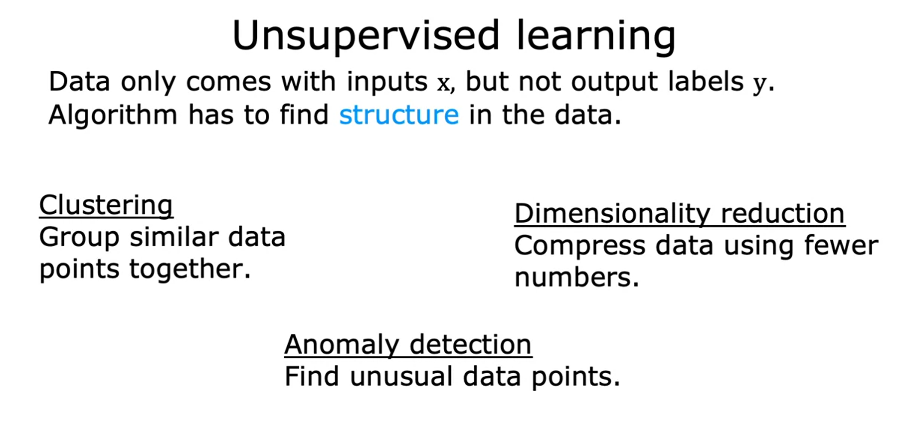

# Unsupervised Learning Part 2
Previously you learned what is unsupervised learning, and one type of unsupervised learning called `clustering`. Let's give a slightly more formal definition of unsupervised learning and take a quick look at some other types of unsupervised learning other than clustering. `Whereas in supervised learning`, <u> the data comes with both inputs x and input labels y </u>, `In unsupervised learning`, <u> the data comes only with inputs x but not output labels y, and the algorithm has to find some structure or some pattern or something interesting in the data </u>. We're seeing just one example of unsupervised learning called a clustering algorithm, which groups similar data points together. 

In this note  you'll learn about clustering as well as two other types of unsupervised learning. One is called `anomaly detection`, `which is used to detect unusual events`. <u> This turns out to be really important for fraud detection in the financial system, where unusual events, unusual transactions could be signs of fraud and for many other applications </u>. You also learn about `dimensionality reduction`. `This lets you take a big data-set and almost magically compress it to a much smaller data-set while losing as little information as possible`. In case anomaly detection and dimensionality reduction don't seem to make too much sense to you yet. Don't worry about it. 

**Question**  (If you don't get it right on the first try, is totally fine.)

**Of the following examples, which would you address using an unsupervised learning algorithm?**   (Check all that apply.)

- [ ] Given a set of news articles found on the web, group them into sets of articles about the same stories.

- [ ] Given email labeled as spam/not spam, learn a spam filter.

- [ ] Given a database of customer data, automatically discover market segments and group customers into different market segments.

- [ ] Given a dataset of patients diagnosed as either having diabetes or not, learn to classify new patients as having diabetes or not.

> [x] Given a set of news articles found on the web, group them into sets of articles about the same stories. 

> [x] Given a database of customer data, automatically discover market segments and group customers into different market segments.

Maybe you remember the spam filtering problem. If you have labeled data you now label as spam or non-spam e-mail, you can treat this as a supervised learning problem. The second example, the news story example. That's exactly the Google News and tangible example that you saw in the last part. You can approach that using a clustering algorithm to group news articles together. The market segmentation example that I talked about a little bit earlier. You can do that as an unsupervised learning problem as well because you can give your algorithm some data and ask it to discover market segments automatically. The final example on diagnosing diabetes. Well, actually that's a lot like our breast cancer example from the supervised learning part. Only instead of benign or malignant tumors, we instead have diabetes or not diabetes. You can approach this as a supervised learning problem, just like we did for the breast tumor classification problem. 

## Before we wrap up this section, I want to share with you something that I find really exciting, and useful, which is the use of [Jupyter Notebooks](./../JupyterNotebook.md) in machine learning.
​

